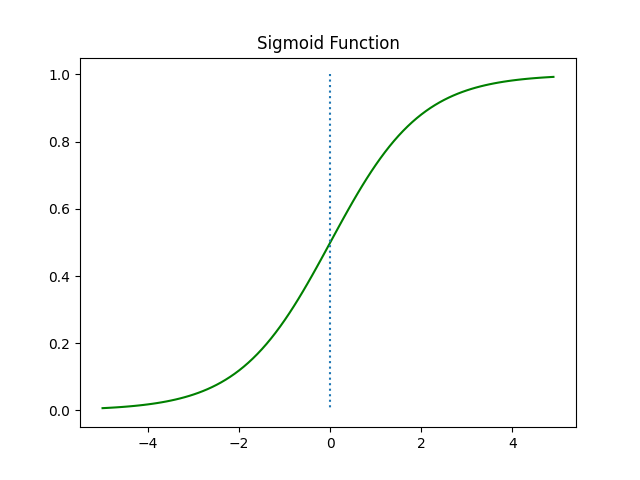
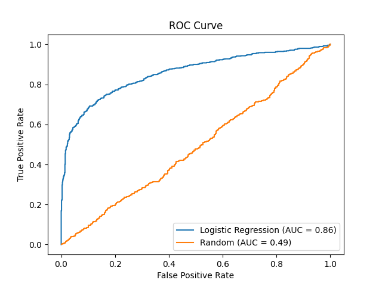

# Tweet Disaster Classification using Logistic Regression

This project aims to build a machine learning model that can predict whether a tweet is about a real disaster or not. The logistic regression model is trained on a dataset of 10,000 tweets provided for [this competition](https://www.kaggle.com/competitions/nlp-getting-started).

Some beautiful formulas explained in this doc are:

$$loss = -\frac{1}{N} \sum_{i=1}^N y_i \log p(y_i \mid x_i) + (1 - y_i) \log (1 - p(y_i \mid x_i))$$

$$\sigma(\textbf{w}^T\textbf{x} + b) = \frac{1}{1 + e^{-(\textbf{w}^T\textbf{x} + b)}}$$

$$\text{AUC} = \frac{1}{2} \sum_{i=1}^{n-1} (x_{i+1} - x_i) (y_i + y_{i+1})$$

## Table of Contents
- [Data](#data)
- [Preprocessing](#preprocessing)
- [Model](#model)
- [Evaluation](#evaluation)
- [Usage](#usage)

## Data
The [data](tweets.csv) contains 10,000 tweets that have been manually classified. Each tweet has a `target` column indicating its label (1 for real disaster, 0 for not) and the following columns:

- The `text` of the tweet
- The `location` the tweet was sent from (may be blank)
- A `keyword` from the tweet (may also be blank)

## Preprocessing
The tweets are preprocessed using the following steps:
- Removing non-alphanumeric characters
- Lowercasing
- Tokenization into individual words
- Removing [stopwords](stopwords.txt) (common words that don't add much meaning to the text)

In code:
```python
def preprocess_text(text):
    # Remove non-alphanumeric characters (except spaces)
    text = re.sub(r"[^a-zA-Z0-9\s]", "", text)
    # Lowercase
    text = text.lower()
    # Split into tokens
    tokens = text.split()
    # Remove stopwords
    tokens = [token for token in tokens if token not in stopwords]
    # Rejoin tokens
    text = " ".join(tokens)
    return text
```

## Model
Being a binary classification problem, I chose to use a [Logistic Regression](https://en.wikipedia.org/wiki/Logistic_regression) classifier. The foundation of this model is the [TF-IDF](https://en.wikipedia.org/wiki/Tf–idf).

### What is Logistic Regression?
Logistic regression is a common baseline model for binary text classification. It models the probability of a class label (such as "disaster" or "not") as a logistic function of a linear combination of features. Ok... so what? A *logistic function* is a function that maps any real value into the range [0, 1]; we will use the sigmoid function for that. A *feature* is a numeric representation of the input data (tweet content); we will use TF-IDF weights to transform tweet text into features that the model can understand. And a *linear combination* is a sum of the features multiplied by their weights, plus a bias term. The weights and bias are learned during the training process.

The probability of classifying a tweet $x$ as a disaster is given by:

$$p(y=1 \mid x) = \sigma(\textbf{w}^T\textbf{x} + b) = \frac{1}{1 + e^{-(\textbf{w}^T\textbf{x} + b)}}$$

where $\sigma$ represents the sigmoid function:

$$\sigma(z) = \frac{1}{1 + e^{-z}}$$

where $z$ is the the linear combination of features $\textbf{w}^T\textbf{x} + b$.

The sigmoid function (a.k.a. *logistic function*) compresses the linear combination of features $\textbf{w}^T\textbf{x} + b$ to transform it into a valid probability value between 0 and 1.

- The weight vector $\textbf{w}$ represents the importance of different features in predicting whether a tweet is a disaster or not.
- The feature vector $\textbf{x}$ is a numeric representation of the tweet's content.
- The bias term $b$ is added to adjust the position of the sigmoid curve along the vertical axis.

### Training 
The model's parameters $\textbf{w}$ and $b$ are learned during the training process. The objective is to minimize the cross-entropy loss, which measures the difference between the predicted probabilities and the actual labels. This is achieved using gradient descent.

$$loss = -\frac{1}{N} \sum_{i=1}^N y_i \log p(y_i \mid x_i) + (1 - y_i) \log (1 - p(y_i \mid x_i))$$

where:
- $N$ represents the total number of training examples (10,000 in our case).
- $y_i$ represents the true label of the $i$-th training example. It's either 0 or 1 (disaster or not).
- $p(y_i \mid x_i)$ is the predicted probability that the $i$-th training example belongs to class 1 (disaster).

Here's the breakdown of the loss formula for the $i$-th training example:

- When $y_i = 1$ (actual label is disaster):

    The first term $y_i \log p(y_i \mid x_i)$ will contribute to the loss, and its value is higher when $p(y_i \mid x_i)$ is closer to 0. This makes sense because if the actual label is 1 (disaster), the loss should be higher when the model is confident that the probability of it being a disaster is very low.

- When $y_i = 0$ (actual label is not a disaster):

    The second term $(1 - y_i) \log (1 - p(y_i \mid x_i))$ will contribute to the loss, and its value is higher when $p(y_i \mid x_i)$ is closer to 1. This makes sense because if the actual label is 0 (not a disaster), the loss should be higher when the model is confident that the probability of it being a disaster is very high.

### WTF is a TF-IDF?
I'm glad you asked. Since logistic regression requires a numeric feature vector as input, the text data needs to be converted to features. A common approach is to use TF-IDF (Term Frequency-Inverse Document Frequency) to vectorize the text.

TF-IDF represents each document as a vector where each dimension corresponds to a term in the corpus vocabulary. The value of each dimension is the product of:

- `Term frequency (TF)`: This measures how often a term (word) appears in a specific tweet, normalized by the length of the tweet. It reflects the importance of the term in that particular tweet.
- `Inverse document frequency (IDF)`: This is the logarithm of the inverse fraction of tweets that contain a specific term. It downweights terms that are commonly found in many tweets, focusing on terms that are more unique to disaster-related content.

The TF-IDF score for a term in a tweet is given by:

$$\text{TF-IDF}(t, d) = \text{TF}(t, d) \times \text{IDF}(t)$$

where $t$ is a term (word), and $d$ is a tweet.

Let's say we have two example disaster-related tweets:

- "Firefighters are battling a huge wildfire near the city."
- "Earthquake shakes buildings, causing panic."

In these examples, words like "firefighters," "wildfire," "earthquake," "shakes," and "panic" might have higher TF-IDF scores compared to more common words.

Therefore, TF-IDF reflects how important a word is to a document within the entire corpus. This converts text into a numeric vector of TF-IDF weights that can be fed into logistic regression.

In code:
```python
# Vectorize text data into TF-IDF features
tfidf = TfidfVectorizer()  
X_train = tfidf.fit_transform(train_texts)
X_test = tfidf.transform(test_texts)

# Train logistic regression model on TF-IDF features
logreg = LogisticRegression()
logreg.fit(X_train, y_train)
```

```python
def sigmoid(x):
    return 1 / (1 + np.exp(-x))
```



## Evaluation
The model achieves a [ROC](https://en.wikipedia.org/wiki/Receiver_operating_characteristic) Area Under the Curve (AUC) score of 0.86 on the validation set, indicating strong predictive performance. To put this in context, the AUC value ranges from 0.5 (indicating random guessing) to 1.0 (representing perfect discrimination).

The formula to calculate the AUC is as follows:

$$\text{AUC} = \frac{1}{2} \sum_{i=1}^{n-1} (x_{i+1} - x_i) (y_i + y_{i+1})$$

This formula sums up the trapezoidal areas under the ROC curve, where $x_i$ and $y_i$ correspond to the false positive rate (FPR) and true positive rate (TPR) at each threshold point. The FPR and TPR are defined as follows:

$$\text{FPR} = \frac{\text{FP}}{\text{FP} + \text{TN}}$$

$$\text{TPR} = \frac{\text{TP}}{\text{TP} + \text{FN}}$$

where TP, FP, TN, and FN represent the number of true positives, false positives, true negatives, and false negatives, respectively.

Ok, so let's see what the ROC curve looks like for our model:



## Usage
To run the model, clone the repo and run the following commands:

```bash
pip install -r requirements.txt
python nlp.py
```

## The End
If you have any questions, feel free to reach out to me on [Twitter](https://twitter.com/kepler256b).
